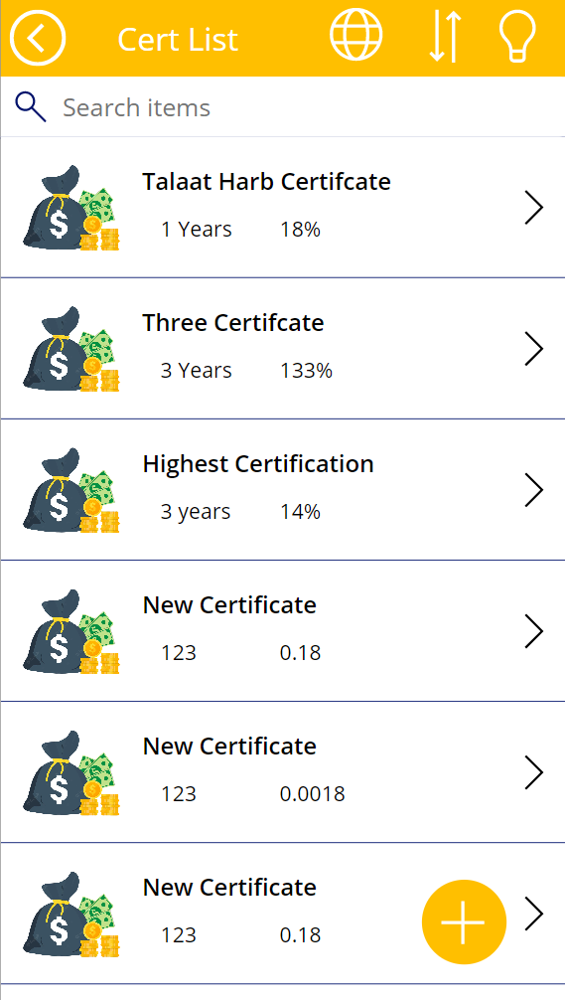
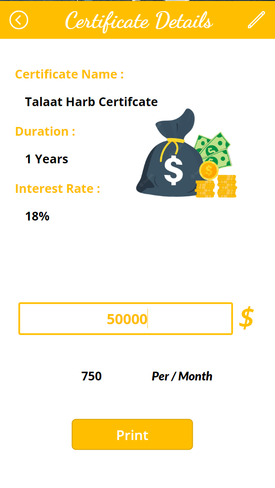
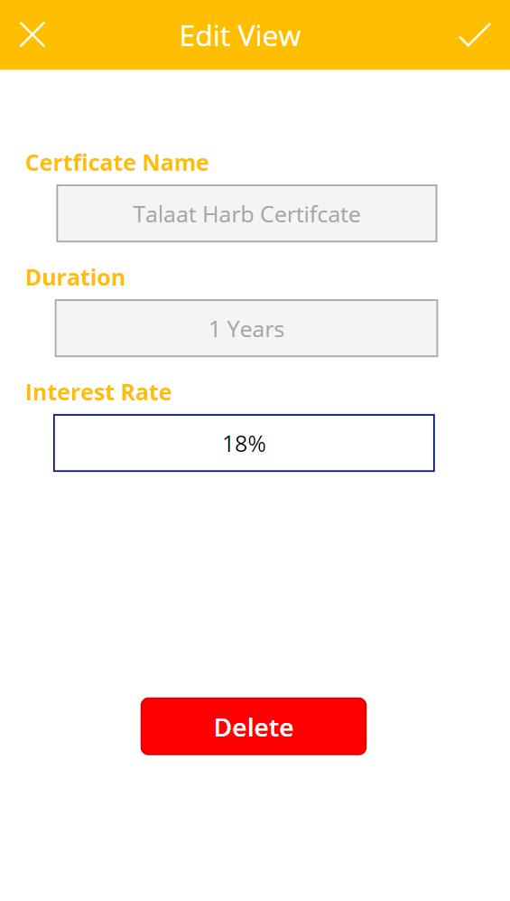
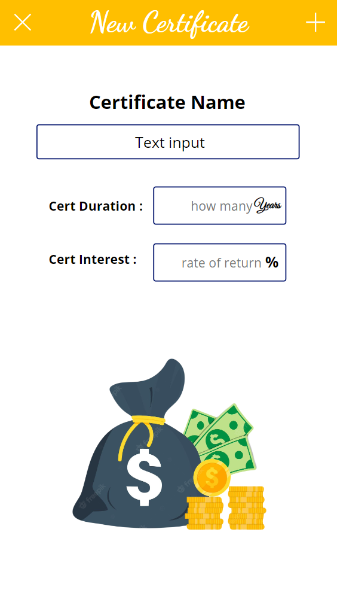

# App Name : 
 <b>CerCal</b>
 
# Description :
 <b>
   <li> this is Certificate Calculator CRUD App for banking sector </li> 
   <li> User Can : Add New Certificate </li> 
   <li> Edit on Certificate Ratio </li> 
   <li> Delete Certificate </li> 
   <li> Caluclate The Interest Ratio Per Month </li> 
   <li> Sort Certificate </li> 
   <li> Use Application In [ En - Ar ] Language </li> 
   <li> User Also able to switch between [ Light - Dark ]  Mode  </li> 
 </b>
 
# Tools :
 <b>Power Apps - Microsoft 365</b>
 
# Link : <a href="https://apps.powerapps.com/play/e/default-6bf95165-4113-4188-9b7b-cb6c0c198a5b/a/776fffb2-0929-40b6-8339-9d5aaefbc9ca?tenantId=6bf95165-4113-4188-9b7b-cb6c0c198a5b&source=portal">Click Here To Open App</a>
 
# Demo : 
 
 
 
 
 
